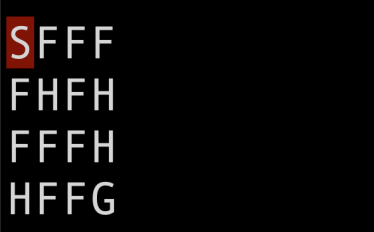

# Reinforcement Learning Algorithms

## [Frozen Lake](https://gym.openai.com/envs/FrozenLake-v0)

- Dynamic Programming Algorithms

    - Policy iteration (includes policy evaluation and policy improvement)
    - Value iteration

- Temporal Different Algorithms
    - Sarsa
    - Q-learning
    - Double Q-learning

The sub-routines for the algorithms are in `algorithms.py`.

The evaluations for each algorithm are in `algorithm_evaluations.ipynb`.
#### Frozen Lake Environment

